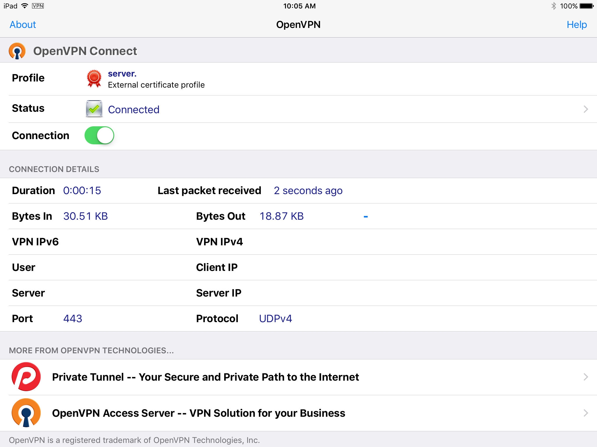

macos-openvpn-server
==================

# macOS OpenVPN Server and Client Configuration

This repo describes how to build an OpenVPN VPN server on macOS using pfctl and [Tunnelblick](../../../../Tunnelblick/Tunnelblick).

This configuration provides a TLS-based VPN server using EC ed25519 certificates and UDP port 443, accessible by any OpenVPN client, especially iOS with the OpenVPN app.



## Installation and Configuration Notes
* Configuration for `openvpn` version 2.5 and [easy-rsa](../../../../OpenVPN/easy-rsa) version 3
* Presumes latest macOS versions that use editable `/etc/sysctl.conf` to set:
> ```
> net.inet.ip.forwarding=1
> net.inet6.ip6.forwarding=1
> ```
This is known to work for macOS 11+. See previous versions of this
repo for a `launchctl`-based approach
* Uses Edwards curve
[ed25519](https://en.wikipedia.org/wiki/Curve25519) EC-based PKI
for very fast VPN connections with 128-bit security

## VPN Configuration Advantages

This OpenVPN configuration provides the following advantages:

* Secure VPN networking for all mobile clients
* Secure, certificate-based VPN
* PF-based [firewall security](../../../osxfortress) on the server
* Privatizing [Proxy Configuration](../../../osxfortress) for all mobile client devices
    * Mobile device networking through PF firewall security
    * Tracker blocking
    * Ad blocking
    * Malware blocking

## [Tunnelblick](../../../../Tunnelblick/Tunnelblick) Configuration

Configure [Tunnelblick](../../../../Tunnelblick/Tunnelblick) settings so that the server connection persists over macOS Fast User Switching. Failure to do this is observed to cause routing problems beyond OpenVPN server accessibility. Use the recommended standard and advanced settings:

| [Tunnelblick](../../../../Tunnelblick/Tunnelblick) Settings |  Advanced… |
:------------------------------------------------------------:|:-------------------------:
|
